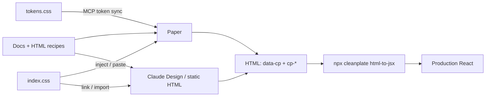

# HLD: Agent-ready HTML → React bridge

**Status:** Team-reviewed (14 Aug 2026) — contract approved; overlay mapping is **Approach B (tiered recipes)**; no-callbacks rule and single-toast snapshot added  
**Date:** 14 Aug 2026  
**Owner:** CleanPlate  
**Audience:** Engineering + design leads  
**Related:** [Paper](https://paper.design/) (HTML/CSS canvas), Cursor / Claude Code, Claude Design

## 1. Problem

CleanPlate is usable for **React coding agents** (`llms.txt`, `docs/*.md`, MCP) but not for **design agents**. Paper and Claude Design author real HTML/CSS. Our styles are CSS Modules with build-time hashes (`button-P7hTI`), so prototypes cannot share production classes. Conversion to React is LLM guesswork. Docs also conflict on spacing (`margin="b-2"` vs `"m-0"`), which already causes wrong React codegen.

JS-heavy components are a second gap: Dropdown placement is runtime `floatingStyles`; Modal/Drawer/Toast portal to `body`; Table **replaces** the `<table>` with `MediaObject` cards below 768px. A single "open-state snapshot" rule is not enough for visual accuracy.

**Ask:** One contract so agents can prototype in HTML quickly and convert to production React without visual or API drift — including overlays and composites, at a **canonical frame**, not live behavior.

## 2. Goal and success criteria

| Goal | Success |
| --- | --- |
| Fast HTML prototypes | Agents compose screens from documented HTML recipes + one CSS file |
| Accurate React | HTML → JSX is **mechanical**, not inferred |
| One visual language | Same `cp-*` classes in prototype HTML and React DOM |
| Honest overlay accuracy | Design agents paint the **canonical frame** for each tier; React owns runtime geometry and behavior |

**What "100%" means**

- **Props / structure:** 100% when `data-cp-*` (and slots/recipes below) are present. Illegal tagged values hard-fail.
- **Pixels:** 100% of the **canonical frame** when the prototype loads the same CSS. Not flip/shift, drag, or breakpoint swaps inside one HTML file.
- **Behavior:** Floating UI, focus trap, scroll lock, Toast queue stay React-only.

## 3. Proposed architecture



**Single source of truth:** React component API. HTML is a lossless encoding of that API. CSS is a public, stable class layer — not a second design system.

Paper cannot consume an npm stylesheet as a native library yet. Paper gets **tokens via MCP** and **CSS via inject/paste**; Claude Design / static HTML may `<link>` or import `index.css` directly.

## 4. Conversion contract

HTML attributes **are** the React props. The converter **does not** infer from class names.

```html
<button
  data-cp="Button"
  data-cp-variant="outline"
  data-cp-size="medium"
  data-cp-margin="b-2"
  class="cp-button cp-button--outline cp-button--medium cp-m-b-2"
>Save</button>
```

```jsx
<Button variant="outline" size="medium" margin="b-2">Save</Button>
```

- `data-cp` = export name (`Button`, `FormControls.Input`, …)
- `data-cp-<prop>` = same enums/values as component docs
- `class="cp-*"` on a tagged node is visual only (ignored by converter)
- **Untagged markup passthrough:** elements without `data-cp` emit as plain JSX (`class` → `className`). Nested tagged nodes still convert. Do not infer `Container` from utility classes.
- **Hard fail** only for tagged nodes: unknown `data-cp` name or illegal enum/value.
- **`data-cp-*` is not a production API.** Published `dist/` does not emit these attributes. Storybook (or an opt-in provider) enables them for round-trip. Default off for apps importing `cleanplate`.
- **Inline geometry is decorative.** Converter **strips** `style` `top` / `left` / `transform` / `width` / `maxHeight` used to fake Floating UI. React recomputes placement from props (`placement`, `isOpen`, …).
- **No callbacks or functions in the contract.** HTML attributes can only encode strings, enums, and booleans. Anything requiring a function prop — `onSelect`, `onSort`, `onRowClick`, `renderOption`, imperative APIs like Toast's queue — is never represented in HTML and is wired by hand after conversion. This applies uniformly across tiers (it's the same rule behind "don't emit a resize listener from HTML" in Tier 3 and "not the imperative queue" in Tier 2 below) rather than a per-component exception.

## 5. Mapping tiers (Approach B)

JS-heavy components are four recipe shapes. Same `data-cp` contract; different HTML trees. Docs ship the recipe(s) for that component's tier.

### Tier 1 — Isomorphic

Markup ≈ React DOM. One recipe.

**Components:** Button, Typography, Icon, Container, Alert, Badge, Avatar, Spinner, FormControls.Input (incl. search), Accordion (open class on items), MenuList, wizard Stepper, desktop Table, desktop AppShell.

**Visual:** Pixel-match if the same CSS is loaded.

### Tier 2 — Overlay snapshot at artboard root

Open **end-state** chrome: overlay + panel, transitions complete (no `useTransitionStyles` inline). Place as a **sibling of the page**, `position: fixed`, covering the artboard — not inside `overflow: hidden` or transformed frames (React portals to `body`).

**Components:** Modal, Drawer, ConfirmDialog, Toast, BottomSheet.

| Component | Canonical frame | Converter |
| --- | --- | --- |
| Modal / Drawer | Overlay dim + panel at CSS position (center / edge / size class) | `data-cp="Modal"` `data-cp-is-open="true"`; slots `title`, `body`, `footer` |
| ConfirmDialog | `.overlay-open` + `.confirm-dialog.open` | Props `title`, `description`, button labels |
| Toast | Fixed host `top: 16px; right: 16px` + one `.toast.{mode}` card. **Single-toast snapshot only** — stacking/offset for multiple concurrent toasts is not represented in the HTML recipe | `data-cp="Toast"` + message/mode (not the imperative queue) |
| BottomSheet | Overlay + sheet; **one baked snap** (e.g. `data-cp-snap="0.3"` → CSS `translateY(70%)`) | `isOpen` + `snap`; no drag listeners in HTML |

**Do not map:** focus trap, scroll lock, Escape/overlay dismiss, enter/exit animation, Toast autoClose/stack, BottomSheet pointer drag.

### Tier 3 — Dual recipes, one React component

JS swaps the tree (not CSS-only responsive). Design agents use **two artboards**. Converter requires `data-cp-recipe`.

| Component | Recipes | React |
| --- | --- | --- |
| Table | `desktop` = `<table>` + cells; `mobile` = `MediaObject` list | `<Table mobileColumns={…}>` — do not emit a resize listener from HTML |
| AppShell | `desktop` = header/sidebar/main; `mobile-drawer` = overlay + drawer `entered` | `<AppShell>` — mobile nav is portal in React |

One HTML file is not required to match both viewports.

### Tier 4 — Canonical anchor, not Floating UI

Closed trigger in flow. Open panel as sibling (Dropdown) or documented portal-root (Select / Date / ColorPicker) with **CSS-only default placement** — e.g. `.cp-dropdown-floating { top: 100%; left: 0; }` — **not** runtime `floatingStyles` / `size()` middleware.

**Components:** Dropdown, FormControls.Select, FormControls.Date, FormControls.ColorPicker.

```html
<div data-cp="Dropdown" data-cp-placement="bottom-start">
  <button data-cp="Button" data-cp-slot="trigger">Account</button>
  <div data-cp-slot="content" class="cp-dropdown-floating" role="menu">
    <!-- MenuList or untagged content -->
  </div>
</div>
```

```jsx
<Dropdown placement="bottom-start" trigger={...} content={...} />
```

- Recipes document **closed** and **open** fixtures. Open uses `*-entered` / opening classes at rest (opacity 1).
- Date open fixture freezes **one month grid**; ColorPicker freezes hue CSS var + thumb `%`.
- Converter maps `data-cp-placement` / `data-cp-slot="trigger|content"` and **strips inline coords**. React Floating UI owns flip, shift, scroll-follow, and trigger-width matching.

**Do not map:** `autoUpdate`, keyboard roving, async Select search, calendar math, ColorPicker pointer capture.

### Visual accuracy contract

| Promise | Do not promise |
| --- | --- |
| Canonical open or closed frame using public `cp-*` | Flip/shift, drag, focus trap, scroll lock |
| Dual artboards for Table / AppShell breakpoints | One HTML file that matches both viewports |
| Converter: slots + `isOpen` / `placement` / `recipe`; strip inline coords | Recreating Floating UI or portals inside Paper |

## 6. CSS change

Hashing is the blocker. Collision safety already exists via the `cp-` prefix.

1. Rename locals to unique BEM (`.button.outline` → `.cp-button--outline`; spacing `m-b-2` → `cp-m-b-2`; overlay locals `.modal` / `.dropdown-floating` / `.toast` → `cp-*`).
2. Stop hashing (`generateScopedName: "[local]"` in Rollup and Storybook).
3. Publish `dist/tokens.css` (`:root` variables) for [Paper token sync](https://paper.design/docs/tokens).
4. Tier 4: add **canonical placement** rules (panel `top: 100%; left: 0` etc.) used only by HTML recipes. React continues to apply `floatingStyles` at runtime; both share chrome (shadow, radius, z-index).
5. Tier 2: public end-state classes (`cp-modal-overlay-open`, `cp-drawer--placement-right`, `cp-bottom-sheet--snap-30`) so canvases do not need inline transforms except documented snap bake-ins.

Do **not** ship dual hashed + public classes.

**Breaking change:** de-hashing is a **semver major**. Hashed class names are observable in shipped CSS. Migration note: drop hashed selectors, use `cp-*` (or `className`). Not a minor config flip.

## 7. Converter and agent surface

- CLI: `npx cleanplate html-to-jsx` driven by a generated component manifest (props, enums, defaults, **slots**, **recipes**, **tier**).
- Illegal values on tagged nodes → exit 1 with a docs link.
- Fixture tests per tier: isomorphic; overlay at root; Table `desktop` + `mobile`; Dropdown open with stripped coords.
- Skills: (1) write the **tier's** recipe (`data-cp` + `cp-*`, portal overlays at artboard root); (2) **run the CLI**, do not invent JSX.
- Docs: HTML recipe(s) in each existing `docs/<Component>.md`. Overlays document closed vs open, and "place overlay at artboard root."
- **Deferred (v1):** manifest/schema versioning. Enum changes stale old HTML until the CLI is rerun.

## 8. Scope

**In (v1):** Tier 1 primitives — Button, Typography, Icon, Container, Alert, Badge, Avatar, Spinner, FormControls.Input; `tokens.css`; CLI (tagged convert, untagged passthrough, strip inline geometry); agent skills; Paper sticker kit; major-version CSS migration note.

**Next (still Approach B):** Accordion, MenuList, wizard Stepper; Table dual recipes; AppShell dual recipes.

**Then:** Tier 2 overlays (Modal, Drawer, ConfirmDialog, Toast, BottomSheet); Tier 4 floaters (Dropdown, Select, Date, ColorPicker) with canonical placement CSS.

**Out:** Web components; LLM-only conversion; a second class system; emitting `data-cp-*` in consumer production DOM; mapping focus trap / scroll lock / drag / Floating UI middleware into HTML; one HTML file that is both Table desktop and mobile; representing Toast stacking/offset in the HTML recipe.

## 9. Risks and mitigations

| Risk | Mitigation |
| --- | --- |
| Unhashing generic locals (`.medium`) collides | Rename to `cp-*` **before** unhashing |
| De-hashing breaks hashed-class overrides | Semver major + migration note |
| `data-cp-*` on every production node | Strip in published `dist/`; opt-in for Storybook only |
| Overlay nested in a frame looks wrong (clip/z-index) | Recipes: Tier 2 at artboard root (`position: fixed`) |
| Dropdown in Paper ≠ React (flip/shift) | Canonical CSS placement; converter strips coords; docs say default frame only |
| Table "responsive" HTML diverges | `data-cp-recipe` required; two artboards |
| Docs drift from CSS/API | Recipes in the same `docs/<Component>.md`; CLI schema from types |
| Paper visual fidelity | Token sync + injected CSS; not a native stylesheet import |
| "100%" oversold for behavior | §2 and §5 state canonical frame, not runtime |
| Function props silently dropped or hallucinated | §4 states no-callbacks rule once, applied uniformly across tiers; hand-wired post-conversion |
| Toast stack misrepresented as single card | §5 Tier 2 states single-toast snapshot only; stacking out of scope (§8) |

## 10. Phased delivery

0. **Hygiene** — spacing API consistency, missing ProgressBar doc, root type re-exports.
1. **Contract** — public CSS + `data-cp` on v1 primitives (Storybook/opt-in only); major bump + migration note.
2. **Convert** — CLI (passthrough, strip geometry), tests, skills, Paper kit for Tier 1.
3. **Coverage** — remaining Tier 1 → Tier 3 (Table, AppShell) → Tier 2 overlays → Tier 4 floaters.

## 11. Decision

**Approved (prior review):** stable `cp-*` CSS + `data-cp-*` = React props + mechanical CLI.

**This revision — Approach B:** overlays and composites use **tiered recipes** (isomorphic / overlay-at-root / dual-recipe / canonical-anchor). Visual accuracy is the canonical frame. Runtime geometry and behavior stay in React.

**Team addenda:** no function props in HTML (hand-wired after conversion); Toast recipe is a single card, not a stack.

**Ask:** Approve Approach B as the overlay-mapping addendum before build of Tiers 2–4 (v1 primitives can proceed on the original contract).
